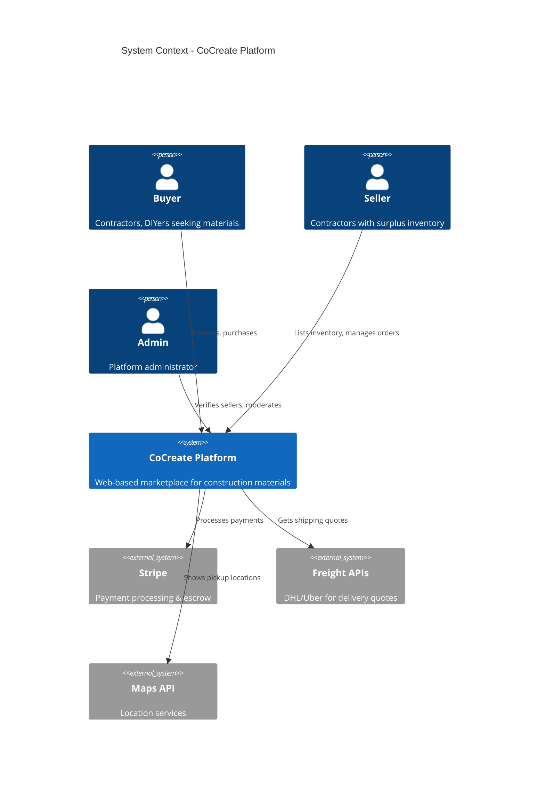
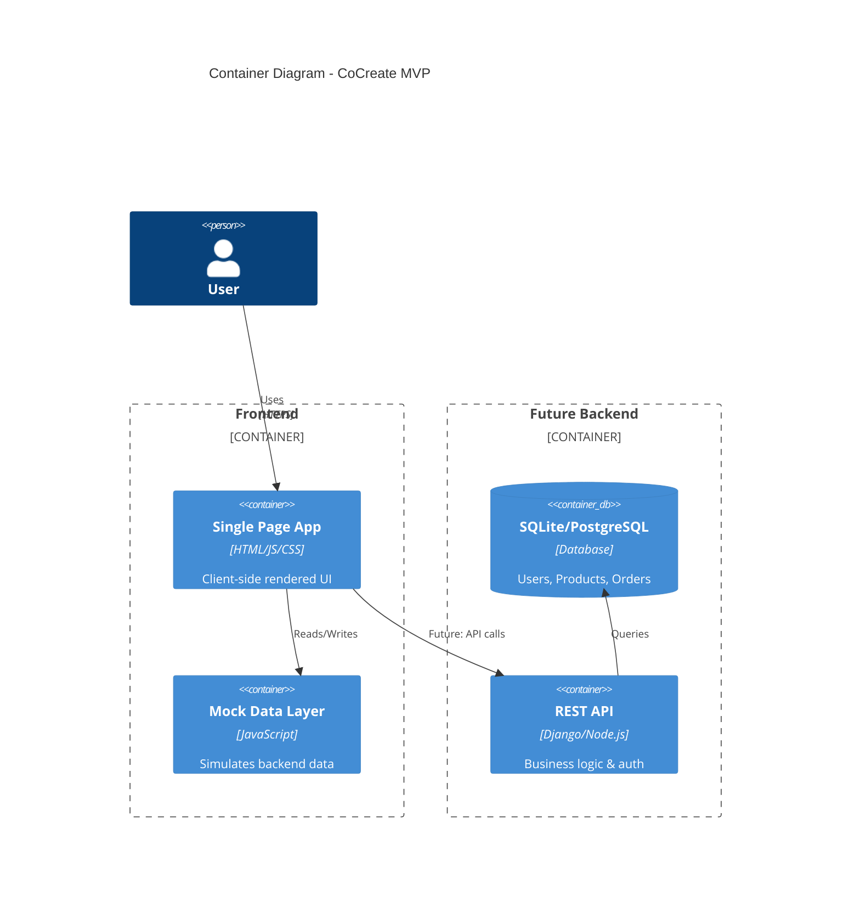
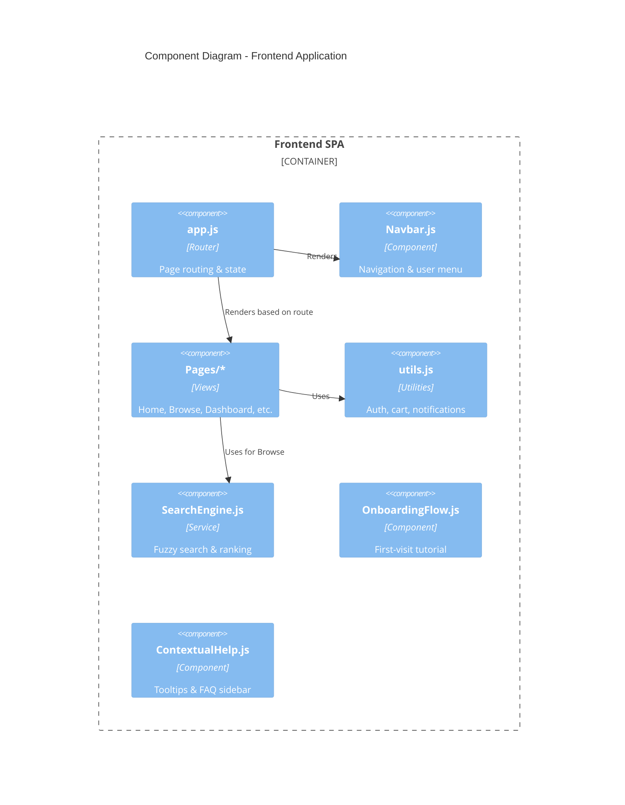

# CoCreate Platform - Architecture Documentation

## Overview

CoCreate is currently a **frontend-only MVP** serving as a proof-of-concept for a B2B2C marketplace connecting contractors with surplus construction materials to buyers (SMEs, tradespeople, DIYers).

---

## C4 Model Diagrams

### Context Diagram



### Container Diagram



### Component Diagram



---

## Technology Stack

| Layer | Current (MVP) | Proposed (Production) |
|---|---|---|
| **Frontend** | Vanilla JS, HTML, CSS | React or Next.js |
| **Styling** | Custom CSS | Tailwind CSS or CSS Modules |
| **State** | Global `AppState` object | Redux / Zustand |
| **Backend** | Mock data (JS objects) | Django REST Framework or Node.js |
| **Database** | localStorage / SQLite (seeded) | PostgreSQL |
| **Auth** | Mock login | JWT + OAuth (Google) |
| **Payments** | Mock | Stripe Connect |
| **Deployment** | Static hosting | Vercel / Railway / AWS |

---

## Composable Architecture Principles

The codebase follows these principles for maintainability:

1. **Separation of Concerns**: Pages, components, utilities, and data are in separate directories.
2. **Single Responsibility**: Each JS file handles one feature (e.g., `SearchEngine.js` only does search).
3. **Stateless Components**: Most render functions take data as input and return HTML strings.
4. **Global State**: `AppState` object in `mockData.js` serves as a simple store.
5. **Event-Driven UI**: `onclick` handlers call global functions that update state and re-render.

**Migration Path**: Replace `renderXPage()` functions with React components; `AppState` → Redux store.

---

## Backend Integration Plan

### Option A: Django + DRF
- **Pros**: Python ecosystem, admin panel, ORM, rapid development.
- **Cons**: Separate frontend deployment, learning curve for JS devs.
- **Use When**: Team prefers Python; need robust admin tools.

### Option B: Node.js + Express
- **Pros**: Same language as frontend, easy to share code, fast.
- **Cons**: Less batteries-included than Django.
- **Use When**: Team prefers JS; need real-time features (Socket.io).

### Recommended: Start with Django
- Use Django REST Framework for API.
- Use Django Admin for seller verification.
- Deploy frontend on Vercel, backend on Railway.

---

## Deployment Strategy

```
┌─────────────────┐      ┌─────────────────┐
│   Vercel        │      │   Railway       │
│   (Frontend)    │ ──→  │   (Django API)  │
│   Static SPA    │      │   PostgreSQL    │
└─────────────────┘      └─────────────────┘
         │                        │
         └────────────────────────┘
                   ↓
         ┌─────────────────┐
         │   Stripe        │
         │   (Payments)    │
         └─────────────────┘
```

### Environment Setup
- **Development**: `python3 -m http.server 8000` (current)
- **Staging**: Vercel preview deployments
- **Production**: Vercel (frontend) + Railway (backend)

---

## Future Features

See [FUTURE_FEATURES.md](file:///Users/thd/Documents/CoCreate/FUTURE_FEATURES.md) for detailed roadmap including:
- Photo metadata verification
- Real-time messaging (WebSockets)
- Advanced analytics dashboard
- Mobile app (React Native)
